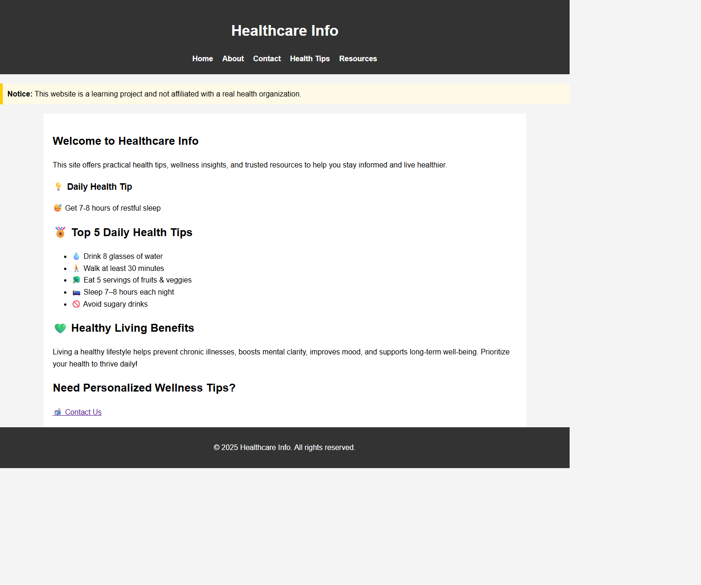
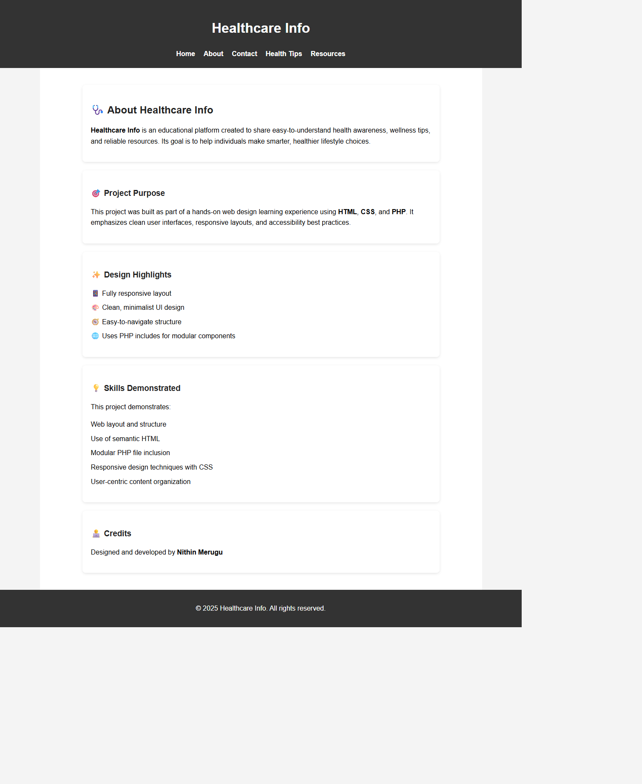
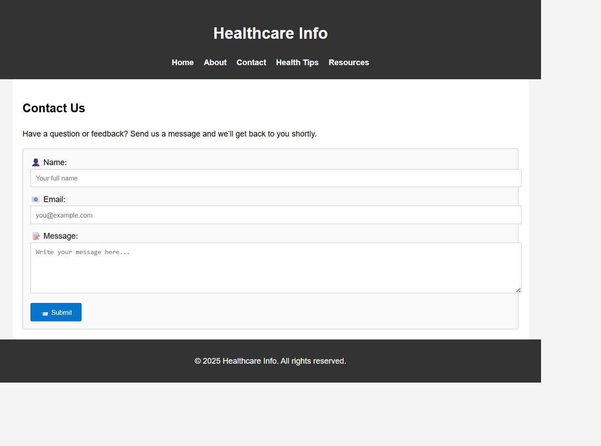
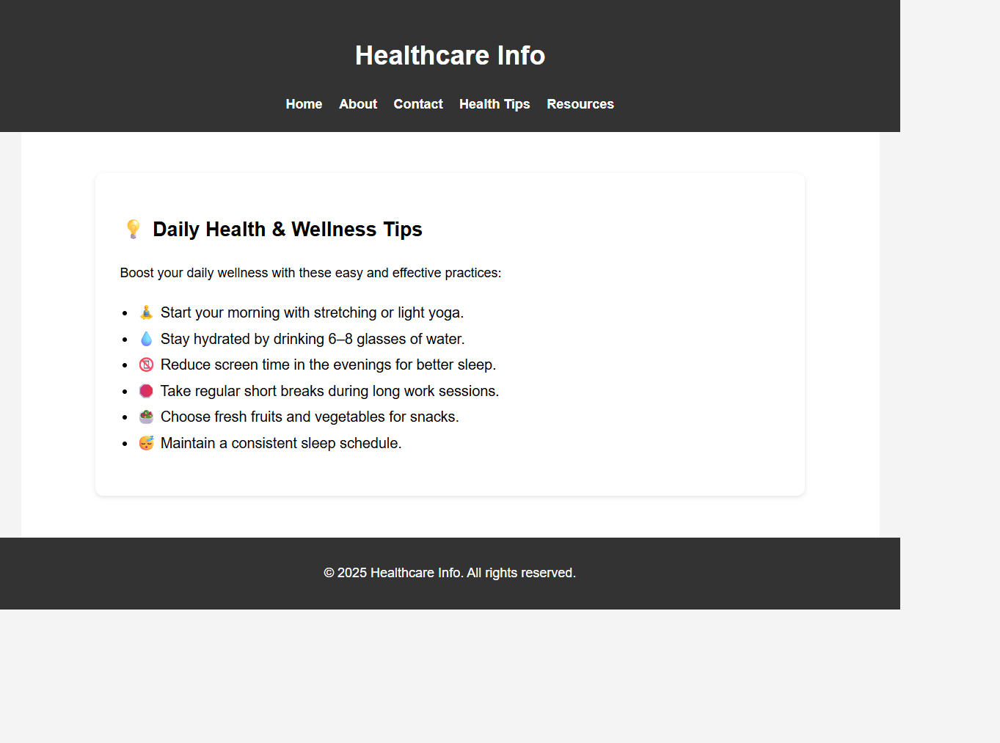
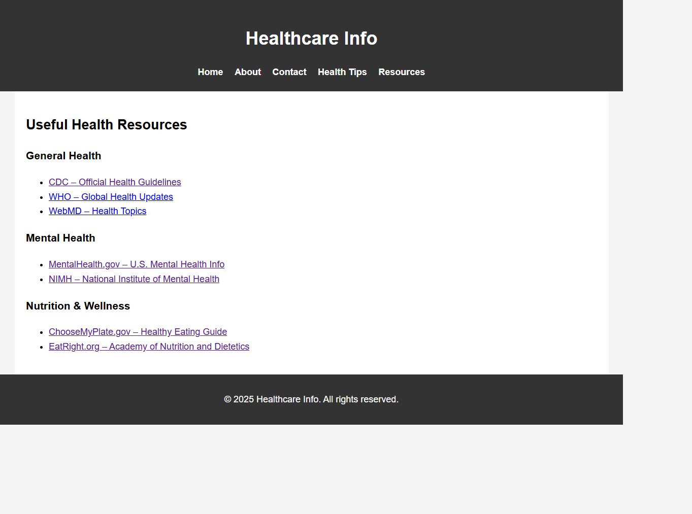

# Healthcare Info Website

This repository contains the full source code for the Healthcare Info website — a responsive, accessible, and user-friendly platform providing health awareness, wellness tips, and trusted resources.

---

## Project Overview

Healthcare Info is a clean, responsive, and highly accessible website designed to empower users with essential wellness tips, COVID-19 updates, and reliable health resources. The site’s goal is to deliver an intuitive, visually balanced experience that supports informed health decisions through clear, content-focused design.

Developed as a personal web design portfolio piece, this project emphasizes modular PHP architecture, accessible UI/UX principles, and responsive layouts that adapt smoothly across devices and screen sizes.

**Key Features:**

- Simple navigation with modular includes for maintainability  
- Clear typography and visual hierarchy optimized for readability  
- Engaging use of icons and subtle color palettes for calm, trustworthiness  
- Trusted health data and resources curated for user confidence  
- Accessibility best practices ensuring usability for diverse audiences  

This project demonstrates my commitment to thoughtful web design that balances aesthetics, usability, and content clarity, crafted using modern HTML, CSS, and PHP development techniques.

---

## Tools and Technologies Used

- Developed the website using **HTML5**, ensuring semantic markup that improves accessibility and SEO, with **CSS3** to create a responsive and visually appealing design adaptable to various screen sizes and devices.  
- Employed **PHP** to modularize the website’s structure by including reusable components like headers and footers, streamlining code maintenance and consistency across pages, and handling form submissions securely on the server side.  
- Utilized **JavaScript** to add dynamic interactivity, such as the rotating daily health tips, enhancing user engagement without requiring page reloads.  
- Used **Visual Studio Code** as the primary development environment, benefiting from its code completion, debugging tools, and integrated terminal to improve development efficiency.  
- Leveraged browser developer tools (e.g., **Chrome DevTools**) for real-time inspection, debugging, performance testing, and ensuring cross-browser compatibility to deliver a polished user experience.  
- Created and refined visual assets and layout prototypes using design tools to ensure a clean and user-friendly interface.

---
## Project Screenshots

### Home Page
  
- The homepage welcomes users with a clear and inviting introduction to the Healthcare Info project, emphasizing practical health advice.  
- It features a dynamic daily health tip carousel that rotates through useful wellness tips every few seconds, enhancing user engagement.  
- The top 5 daily health tips are highlighted with emojis and simple language to encourage healthy habits.  
- The page ends with a call-to-action inviting users to contact for personalized wellness advice, making navigation intuitive and purposeful.

---

### About Page
  
- This page explains the purpose of the Healthcare Info project, focusing on health education and wellness awareness.  
- It highlights the project’s key design principles like responsive layout, clean UI, and modular PHP structure for maintainability.  
- Skills demonstrated through the project include semantic HTML, CSS responsive design, and user-centric content organization.  
- The page credits the developer, reinforcing professional authorship and accountability.

---

### Contact Page
  
- The contact page provides a simple, accessible form allowing users to send feedback or inquiries directly through the site.  
- It includes clear labeling of fields (Name, Email, Message) with placeholder text for improved usability and accessibility.  
- Form submission is handled securely via PHP on the backend, ensuring data is processed safely.  
- The page maintains consistent site branding with header and footer includes, preserving a unified user experience.

---

### Health Tips Page
  
- This page presents a curated list of practical health and wellness tips designed to foster daily positive habits.  
- Each tip is paired with a relevant emoji to make the advice engaging and visually appealing.  
- The content is structured in a clear, easy-to-read format with appropriate spacing and font sizing.  
- The page layout is responsive and styled with CSS to maintain readability across devices.

---

### Resources Page
  
- The resources page organizes important external health information sources into categories: General Health, Mental Health, and Nutrition & Wellness.  
- Links open in new tabs to direct users to trusted websites like CDC, WHO, and official nutrition sites, boosting credibility.  
- The clean layout with headings and bulleted lists aids quick scanning and easy navigation.  
- This page supports the project’s goal of promoting informed health decisions through reliable, curated content.

---

## Project Structure Overview

The project is built with modular PHP includes for header and footer, semantic HTML, CSS styling, and basic JavaScript for dynamic content. The backend stores contact form submissions in a text file without a database, ideal for simple hosting.

---

## Header.php Code Explanation

This `header.php` file defines the consistent header section displayed at the top of every page on the Healthcare Info website.

- It starts with the HTML5 doctype and sets the language attribute to English for accessibility and SEO.
- The `<head>` section includes metadata and links the external CSS stylesheet (`css/style.css`) for styling across the site.
- Inside the `<body>`, the header contains the site title wrapped in an `<h1>` tag for clear branding and SEO benefits.
- A navigation bar (`<nav>`) follows, containing an unordered list (`<ul>`) of links (`<a>`) to the main website pages: Home, About, Contact, Health Tips, and Resources.
- This modular header can be included in all pages via PHP includes to maintain consistency and simplify updates.

---

## Footer.php Code Explanation

This `footer.php` file defines the consistent footer section displayed at the bottom of every page on the Healthcare Info website.

- The `<footer>` element contains a paragraph that dynamically displays the current year using PHP’s `date("Y")` function, ensuring the copyright year is always up to date.
- It includes a simple copyright notice with the site name, reinforcing ownership and professionalism.
- The footer closes the `<body>` and `<html>` tags, properly ending the HTML document structure.
- Like the header, this modular footer can be included across all pages with PHP includes, promoting code reuse and easy maintenance.

---

## Index.php (Home Page) Code Explanation

This `index.php` file serves as the homepage and central landing page of the Healthcare Info website.

- It begins by including the common `header.php` and a site-wide `notice.html` banner or announcement.
- The **Hero Section** introduces visitors with a welcoming heading and concise site purpose.
- The **Dynamic Daily Health Tip** section uses JavaScript to rotate health tips every few seconds, increasing engagement.
- The **Top 5 Daily Health Tips** section displays actionable health advice with emojis for visual appeal.
- The **Healthy Living Benefits** section highlights the positive outcomes of a healthy lifestyle.
- A **Call to Action (CTA)** encourages users to contact for personalized wellness tips.
- The page ends by including a common `footer.php` for consistent footer content.

---

## About.php Code Explanation

This `about.php` page provides an overview of the Healthcare Info project.

- Structured with semantic HTML sections wrapped by PHP includes for modularity.
- Describes the platform’s purpose as an educational tool for health awareness and wellness.
- Details the project purpose highlighting hands-on experience with HTML, CSS, and PHP.
- Lists design highlights such as responsive layouts, clean UI, and modular PHP components.
- Describes the key skills demonstrated, including semantic HTML, responsive CSS, and content organization.
- Credits the developer, emphasizing professional ownership.
- The modular header and footer includes maintain consistency across pages.

---

## Contact.php Code Explanation

This `contact.php` page offers a simple, accessible contact form for user feedback.

- Includes the reusable header and footer with PHP includes.
- Contains a section with a heading and introductory text encouraging users to send messages.
- The contact form uses the POST method and submits to `save_contact.php`.
- Inputs include Name and Email fields with placeholders and validation (`required`).
- A textarea collects user messages.
- The submit button features styling and emoji for user-friendly interaction.
- Form inputs are wrapped in styled divs for consistent layout.

---

## Tips.php Code Explanation

The `tips.php` page shares daily health and wellness tips to encourage healthy habits.

- Wrapped with modular header and footer includes.
- Main content is in a `<section>` with a descriptive heading and introductory paragraph.
- Displays a list of wellness tips as an unordered list with emojis enhancing readability.
- CSS classes enable targeted styling for spacing, font size, and layout.
- Designed for clarity and motivation to adopt positive lifestyle changes.

---

## Resources.php Code Explanation

The `resources.php` page organizes external links to trusted health organizations and informational sites.

- Includes common header and footer PHP includes.
- Content divided into three sections: General Health, Mental Health, and Nutrition & Wellness.
- Each section contains a heading and a list of external links opening in new tabs.
- Uses semantic HTML for accessibility and ease of navigation.
- Provides users quick access to reliable information for health education and decision-making.

---

## Save_contact.php Code Explanation

This `save_contact.php` script processes contact form submissions.

- Checks if the form was submitted via the POST method.
- Retrieves and sanitizes user inputs (name, email, message) using `htmlspecialchars()` and `trim()`.
- Formats the data into a plain-text entry.
- Appends the entry to a text file (`data/contact_submissions.txt`) for storage.
- Includes standard header and footer PHP includes for consistent layout.
- Displays a personalized thank-you message confirming submission.
- Provides a link for users to return to the homepage.
- Suitable for simple backend data collection without a database.

---

## Style.css Code Explanation

This stylesheet defines the visual appearance and layout of the Healthcare Info website.

- Sets global font, margin, padding, line-height, and background color for clean readability.
- Styles the header and footer with dark backgrounds, centered white text, and consistent padding.
- Uses flexbox for a horizontal, centered navigation menu with spacing and hover effects.
- Defines main content area with maximum width, padding, and white background.
- Styles forms with light backgrounds, borders, rounded corners, full-width inputs, and styled submit buttons.
- Adds a notice box with yellow background and border to highlight important messages.
- Styles sections like `.about-section` and `.tips-section` with background, padding, border-radius, and subtle shadows for card-like appearance.
- Enhances list readability with spacing and font size adjustments.
- Designed for simplicity, clarity, and accessibility across devices.

---

---

## Project Overview

Healthcare Info is a clean, accessible, and responsive web project aimed at providing users with practical wellness tips, reliable health resources, and up-to-date information to support healthier lifestyle choices. Built as a personal portfolio piece, this project emphasizes modular PHP development, semantic HTML5, and modern CSS techniques to ensure maintainability and great user experience across all devices.

The site features dynamic content such as a rotating daily health tip carousel powered by JavaScript, clear navigation through reusable header and footer includes, and a secure contact form handled by PHP backend processing. Content pages like About, Tips, Resources, and Contact are designed with accessibility and usability in mind—offering friendly layouts, clear typography, and engaging visual cues like emojis to encourage user interaction.

This project demonstrates skills in:

- Full-stack web development including PHP backend scripting and frontend HTML/CSS/JS
- Responsive and accessible UI design focused on readability and user engagement
- Modular code organization using PHP includes to promote consistency and ease of maintenance
- Integration of dynamic content to enhance the user experience without full page reloads

Overall, Healthcare Info reflects a commitment to thoughtful, user-centric web design that balances clean aesthetics with functional performance, making it a strong portfolio project showcasing practical web development abilities.

Feel free to explore the repository and review the well-documented code to understand how these concepts are implemented.

---

Thank you for exploring the Healthcare Info project!  
Designed and developed by **Nithin Merugu**.

---

